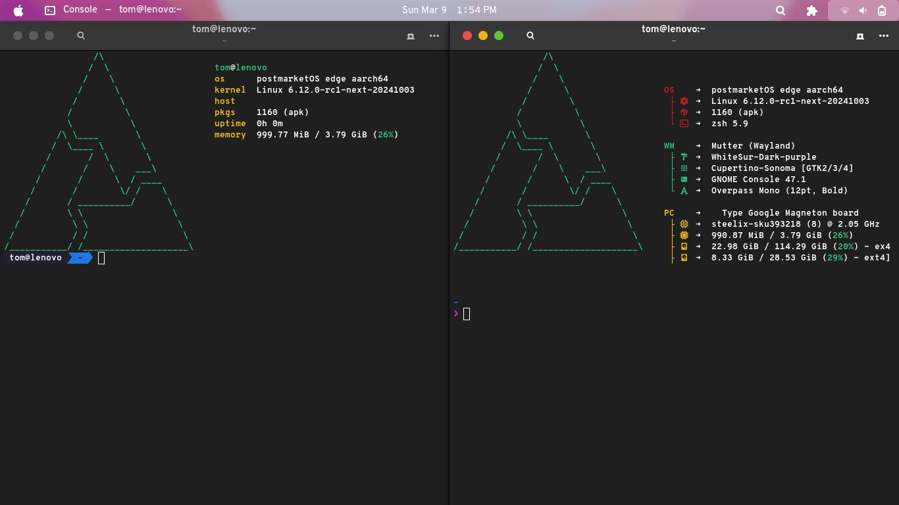

# Zsh

<h3 align="left">
Hello! This is my .zshrc repo. Feel free to look around!
This is my first repo, so sorry if it isn't too good.
</h3>

<p align="center">
  
</p>

## Credits & Links

[Zsh](https://www.zsh.org) is the foundation for everything.
[Oh my Zsh!](https://ohmyz.sh) is the project I use for theming and (most) plugins.
[Fastfetch Configs](https://github.com/LierB/fastfetch) is the project I use to get my fastfetch configs. 

## Prerequisites

```bash
zsh
zsh-autosuggestions
zsh-syntax-highlighting
fastfetch
```

You will also need Oh my Zsh! and Fastfetch Configs, which can be installed by executing;
```bash
sh -c "$(curl -fsSL https://raw.githubusercontent.com/ohmyzsh/ohmyzsh/master/tools/install.sh)"
```
As a user, **NOT** as root/sudo!

## Installation

```bash
git clone https://github.com/treid998/zshrc.git
mv -v ~/.zshrc ~/.zshrc.bak
cp -v (path to .zshrc repo)/zshrc/(desired .zshrc) ~/.zshrc
source ~/.zshrc
```

## Final words

Thank you for checking out my repo!!
If you have any suggestions, feel free to reach out or submit an issue.

Blah blah blah, something something, oh please please star my repo!!!! ;((((( pls pls pls!!!

> tom was here
